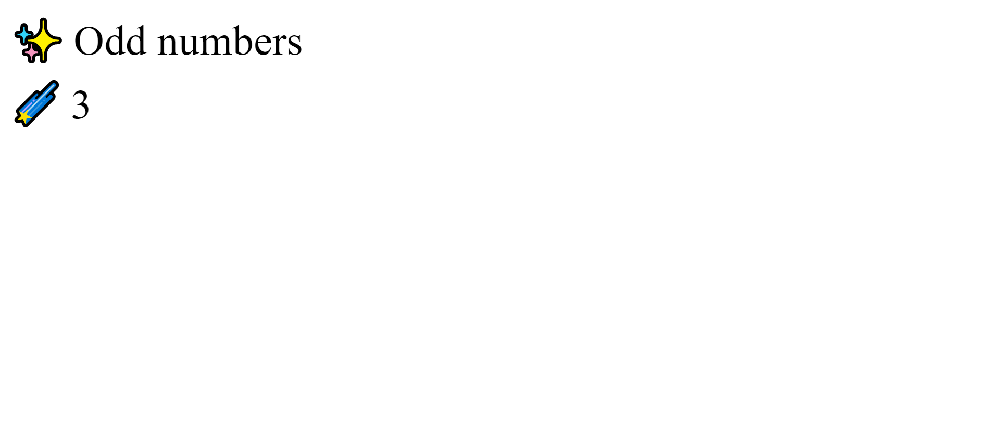

Есть два эндпоинта
1 JSON response
2 красивый html

пример JSON response

methode: GET <br>
link: http://127.0.0.1:8000/api/2/3 <br>

response (если 2 четные будет пустой список, есть сериализатор, методы)
```json
{
    "first": 2,
    "second": 3,
    "result": [
        3
    ]
}
```

Пример красивый html

methode: GET <br>
link: http://127.0.0.1:8000/pretty/2/3 <br>

response (если 2 четные будет надпись на английском что нечетных нет)




